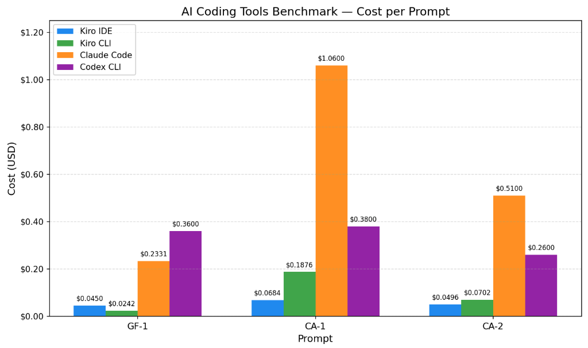

# Sample AI Coding Tools Benchmark

A side-by-side comparison of popular AI coding tools. We run the same prompts
through each tool and measure how they stack up on **cost**, **speed**, and
**correctness**.

## Latest Report

- Run date: **2026-05-31** (Kiro IDE, Kiro CLI, Claude Code)
- Run date: **2026-06-09** (Codex CLI)

### Evaluated Scenarios
- **GF-1** — Greenfield build: produce a fresh, spec-bound CLI to-do app from scratch.
- **CA-1** — Brownfield analysis: read an existing TypeScript API and explain architecture, pricing, and state machine.
- **CA-2** — Brownfield investigation: pinpoint which check rejects a specific request and what response it returns.

| Prompt | Tool | Model | Effort | Credits Used | Cost (USD) | Time (s) | Lines Generated | Input Tokens | Output Tokens | Cached Tokens |
| ------ | ---- | ----- | ------ | ------- | ---------- | -------- | --------------- | ------------ | ------------- | ------------- |
| [GF-1](./references/prompts.md#1-greenfield-new-project--gf)        | Kiro IDE    | claude-opus-4-7 | xHigh | 2.25 | **$0.0450** | 61  | 195 | NA     | NA    | NA      |
| [GF-1](./references/prompts.md#1-greenfield-new-project--gf)        | Kiro CLI    | claude-opus-4-7 | xHigh | 1.21 | **$0.0242** | 36  | 195 | NA     | NA    | NA      |
| [GF-1](./references/prompts.md#1-greenfield-new-project--gf)        | Claude Code | claude-opus-4-7 | xHigh | NA   | **$0.2331** | 80  | 163 | NA     | NA    | NA      |
| [GF-1](./references/prompts.md#1-greenfield-new-project--gf)        | Codex CLI   | gpt-5.5         | High  | NA   | **$0.3600** | 130 | 118 | 33,210 | 3,447 | 190,336 |
| [CA-1](./references/prompts.md#2-code-analysis--understanding--ca)  | Kiro IDE    | claude-opus-4-7 | xHigh | 3.42 | **$0.0684** | 108 | 155 | NA     | NA    | NA      |
| [CA-1](./references/prompts.md#2-code-analysis--understanding--ca)  | Kiro CLI    | claude-opus-4-7 | xHigh | 9.38 | **$0.1876** | 242 | 206 | NA     | NA    | NA      |
| [CA-1](./references/prompts.md#2-code-analysis--understanding--ca)  | Claude Code | claude-opus-4-7 | xHigh | NA   | **$1.0600** | 195 | 156 | NA     | NA    | NA      |
| [CA-1](./references/prompts.md#2-code-analysis--understanding--ca)  | Codex CLI   | gpt-5.5         | High  | NA   | **$0.3800** | 114 | 258  | 28,328 | 4,955 | 182,656 |
| [CA-2](./references/prompts.md#2-code-analysis--understanding--ca)  | Kiro IDE    | claude-opus-4-7 | xHigh | 2.48 | **$0.0496** | 65  | 149 | NA     | NA    | NA      |
| [CA-2](./references/prompts.md#2-code-analysis--understanding--ca)  | Kiro CLI    | claude-opus-4-7 | xHigh | 3.51 | **$0.0702** | 74  | 144 | NA     | NA    | NA      |
| [CA-2](./references/prompts.md#2-code-analysis--understanding--ca)  | Claude Code | claude-opus-4-7 | xHigh | NA   | **$0.5100** | 139 | 65  | NA     | NA    | NA      |
| [CA-2](./references/prompts.md#2-code-analysis--understanding--ca)  | Codex CLI   | gpt-5.5         | High  | NA   | **$0.2600** | 53  | 92  | 26,436 | 2,119 | 128,640 |

> Assumptions:
> Kiro costs derived from credits used at $0.02/credit.
> Claude Code cost is the reported run cost in /usage command. 
> Codex CLI cost is an API-equivalent pay-per-use pricing on OpenAI.

### Attached reports
- [`evaluations/2026-05-31/evaluation-report-2026-05-31.md`](./evaluations/2026-05-31/evaluation-report-2026-05-31.md)
- [`evaluations/2026-05-31/evaluation-report-2026-05-31.md`](./evaluations/2026-06-09/evaluation-report-2026-06-09.md)

## Tools Under Test

| Tool | Output Folder |
| ----------- | ------------- |
| Claude Code | [`./evaluations/2026-05-31/claude-code/`](./evaluations/2026-05-31/claude-code/) |
| Kiro CLI | [`./evaluations/2026-05-31/kiro-cli/`](./evaluations/2026-05-31/kiro-cli/) |
| Kiro IDE | [`./evaluations/2026-05-31/kiro-ide/`](./evaluations/2026-05-31/kiro-ide/) |
| Codex CLI | [`./evaluations/2026-06-09/codex/`](./evaluations/2026-06-09/codex/) |

## How It Works

1. **Define the prompts.** Shared prompts live in (./samples/prompts/prompts-*.md).
2. **Run each tool.** Give the same prompt to each tool.
3. **Save the output.** Drop each tool's result in its matching folder above.
4. **Record the metrics.** Track the numbers for every run.

## Metrics We Track

- **Cost**: token/credit usage or dollar cost for the run.
- **Speed**: wall-clock time from prompt to finished result.
- **Results**: correctness of the output. (To be expanded upon)

## Security

See [CONTRIBUTING](CONTRIBUTING.md#security-issue-notifications) for more information.

## License

This library is licensed under the MIT-0 License. See the LICENSE file.
