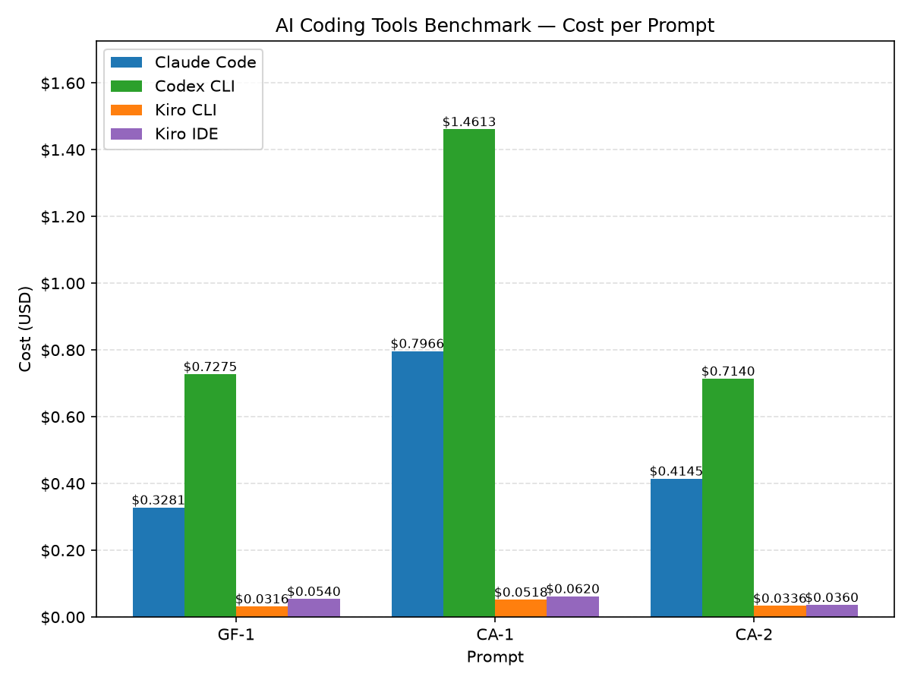
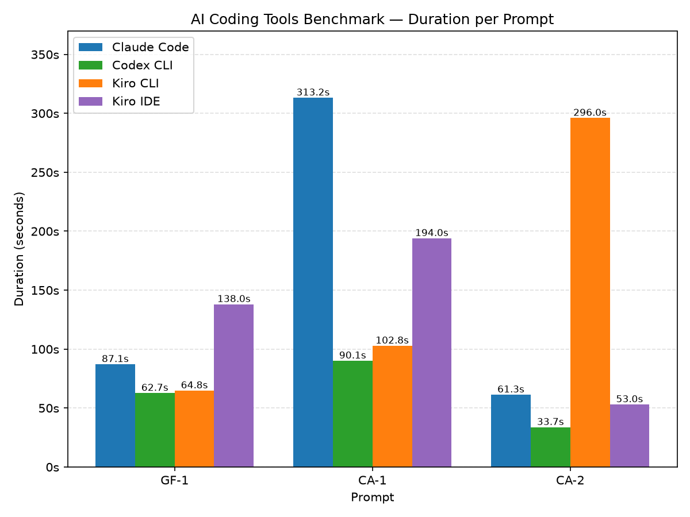

# Sample AI Coding Tools Benchmark

A side-by-side comparison of popular AI coding tools. We run the same prompts
through each tool and measure how they stack up on **cost**, **speed**, and
**correctness**.

## Latest Report

- Run date: **2026-06-24** (Kiro IDE, Kiro CLI, Claude Code on Bedrock, Codex on Bedrock)

- Full PDF report: [`evaluations/2026-06-24/evaluation-report-2026-06-24.pdf`](./evaluations/2026-06-24/evaluation-report-2026-06-24.pdf)

### Evaluated Scenarios
- **GF-1** — Greenfield build: produce a fresh, spec-bound CLI to-do app from scratch.
- **CA-1** — Brownfield analysis: read an existing TypeScript API and explain architecture, pricing, and state machine.
- **CA-2** — Brownfield investigation: pinpoint which check rejects a specific request and what response it returns.

### Full results matrix

| Scenario | Tool | Cost (USD) | Time (s) | Lines | Input Tokens | Output Tokens |
| -------- | ---- | ---------- | -------- | ----- | ------------ | ------------- |
| GF-1 | Claude Code | **$0.3281** | 87.1  | 197 | 2,448   | 4,079  |
| GF-1 | Codex CLI   | **$0.7275** | 62.7  | 164 | 106,652 | 4,270  |
| GF-1 | Kiro CLI    | **$0.0316** | 64.8  | 189 | NA      | NA     |
| GF-1 | Kiro IDE    | **$0.0540** | 138.0 | NA  | NA      | NA     |
| CA-1 | Claude Code | **$0.7966** | 313.2 | 308 | 2,577   | 16,931 |
| CA-1 | Codex CLI   | **$1.4613** | 90.1  | 324 | 228,014 | 6,279  |
| CA-1 | Kiro CLI    | **$0.0518** | 102.8 | 281 | NA      | NA     |
| CA-1 | Kiro IDE    | **$0.0620** | 194.0 | NA  | NA      | NA     |
| CA-2 | Claude Code | **$0.4145** | 61.3  | 111 | 2,446   | 4,745  |
| CA-2 | Codex CLI   | **$0.7140** | 33.7  | 96  | 115,527 | 2,383  |
| CA-2 | Kiro CLI    | **$0.0336** | 296.0 | 88  | NA      | NA     |
| CA-2 | Kiro IDE    | **$0.0360** | 53.0  | NA  | NA      | NA     |

> Assumptions:
> Kiro costs derived from credits used at $0.02/credit.
> Claude Code cost is the reported run cost in /usage command. 
> Codex CLI cost is based on token pricing on Amazon Bedrock.

## Metrics We Track

- **Cost**: token/credit usage or dollar cost for the run.
- **Speed**: wall-clock time from prompt to finished result.
- **Results**: correctness of the output. (To be expanded upon)

## Methodology

- See full report in: [`evaluations/2026-06-24/evaluation-report-2026-06-24.pdf`](./evaluations/2026-06-24/evaluation-report-2026-06-24.pdf)

## Security

See [CONTRIBUTING](CONTRIBUTING.md#security-issue-notifications) for more information.

## License

This library is licensed under the MIT-0 License. See the LICENSE file.
