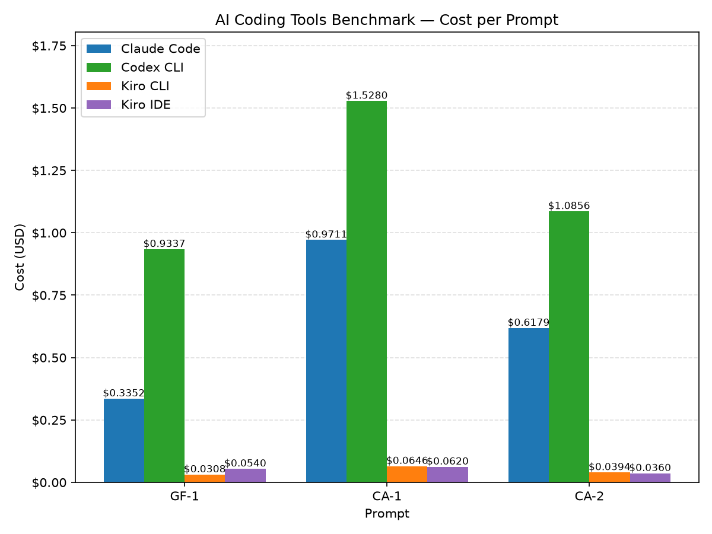
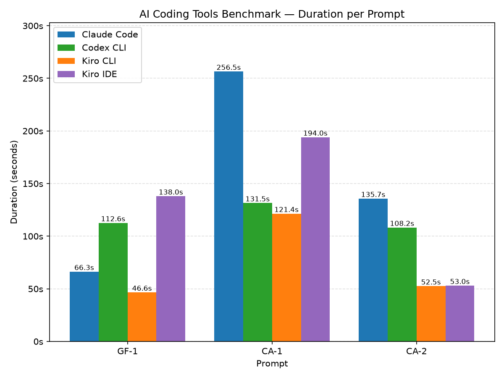

# Evaluation Report — 2026-06-25

A side-by-side comparison of four AI coding tools run against an identical set
of prompts. Each tool was measured on **cost**, **speed**, and **correctness** across three scenarios: one greenfield build and two brownfield
analysis tasks.

## Summary

- **Run date:** 2026-06-25
- **Aggregation:** mean over 1 run per tool/scenario
- **Mode:** Automated
- **Tools under test:** Claude Code, Codex CLI, Kiro CLI, Kiro IDE

**Headline findings**

- **Lowest cost:** Kiro CLI at **$0.1348** total across the three scenarios —
  roughly 26x cheaper than Codex CLI and 14x cheaper than Claude Code.
- **Fastest:** Kiro CLI completed all three scenarios in **220.5s** total
  (73.5s average), the quickest of the group.
- **Most expensive:** Codex CLI at **$3.5473** total, driven by large input
  token counts billed at the GPT-5.5 rate.
- **Best cost/speed balance:** Kiro CLI — the cheapest and the fastest tool in
  this run. Kiro IDE was the second-cheapest ($0.1520 total) at credit-based
  pricing close to Kiro CLI.

## Configuration

| Tool | Model | Effort | Mode |
| ---- | ----- | ------ | ---- |
| Claude Code | us.anthropic.claude-opus-4-8 | xHigh | Automated |
| Codex CLI | openai.gpt-5.5 | xHigh | Automated |
| Kiro CLI | claude-opus-4.8 | xHigh | Automated |
| Kiro IDE | claude-opus-4.8 | xHigh | Manual |

## Methodology

- **Harness:** runs were executed and aggregated by `tools/run_benchmark.py`
  (run-average mode) and recorded in `run-complete.json`.
- **Procedure:** each tool received the identical prompt for each scenario, run
  in Automated mode with no manual intervention. Output was written to the
  tool's designated folder and metrics captured from each tool's own usage
  reporting.
- **Runs and aggregation:** 1 run per tool/scenario; reported figures are the
  mean (a single run here, so mean equals the observed value).
- **Metrics captured:**
  - *Cost (USD)* — derived per the pricing and methodology below.
  - *Time (s)* — wall-clock elapsed time from prompt to finished result.
  - *Lines* — lines of output produced (where reported by the tool).
  - *Tokens* — input/output token counts (where reported by the tool).
- **Held constant:** prompts, scenario order, model effort level (xHigh across
  all tools), and Automated mode across all tools.
- **Not scored:** correctness/quality of output is out of scope for this run
  and assessed separately.

## Pricing

**OpenAI GPT 5.5 (on Amazon Bedrock)** — used for Codex CLI

| Token type | Price per 1M tokens |
| ---------- | ------------------- |
| Input | $5.50 |
| Cached input | $0.55 |
| Output | $33.00 |

**Claude Opus 4.8 (on Amazon Bedrock)** — used for Claude Code

| Token type | Price per 1M tokens |
| ---------- | ------------------- |
| Input | $5.00 |
| Output | $25.00 |

**Kiro credits** — used for Kiro CLI and Kiro IDE

| Unit | Price |
| ---- | ----- |
| Per credit | $0.02 |

**Cost methodology**

- **Kiro CLI / Kiro IDE:** derived from credits consumed at **$0.02/credit**.
- **Claude Code:** reported run cost in USD from the `/usage` command
  (Connected to Amazon Bedrock, Claude Opus 4.8 at $5.00/1M input and
  $25.00/1M output; reported totals also include cache read/write).
- **Codex CLI:** computed from session token totals using the GPT-5.5 on
  Amazon Bedrock pricing above (input × $5.50/1M + output × $33.00/1M).

## Evaluated Scenarios

- **GF-1** — Greenfield build: produce a fresh, spec-bound CLI to-do app from
  scratch.
- **CA-1** — Brownfield analysis: read an existing TypeScript API and explain
  architecture, pricing, and the order state machine.
- **CA-2** — Brownfield investigation: pinpoint which check rejects a specific
  request and what response it returns.

## Results

### Full results matrix

| Scenario | Tool | Model | Effort | Cost (USD) | Time (s) | Lines | Input Tokens | Output Tokens |
| -------- | ---- | ----- | ------ | ---------- | -------- | ----- | ------------ | ------------- |
| GF-1 | Claude Code | Claude Opus 4.8 | xHigh | **$0.3352** | 66.3  | 209 | 2,311   | 6,257  |
| GF-1 | Codex CLI   | GPT-5.5         | xHigh | **$0.9337** | 112.6 | 154 | 128,130 | 6,940  |
| GF-1 | Kiro CLI    | Claude Opus 4.8 | xHigh | **$0.0308** | 46.6  | 203 | NA      | NA     |
| GF-1 | Kiro IDE    | Claude Opus 4.8 | xHigh | **$0.0540** | 138.0 | NA  | NA      | NA     |
| CA-1 | Claude Code | Claude Opus 4.8 | xHigh | **$0.9711** | 256.5 | 330 | 2,446   | 22,590 |
| CA-1 | Codex CLI   | GPT-5.5         | xHigh | **$1.5280** | 131.5 | 211 | 229,972 | 7,974  |
| CA-1 | Kiro CLI    | Claude Opus 4.8 | xHigh | **$0.0646** | 121.4 | 269 | NA      | NA     |
| CA-1 | Kiro IDE    | Claude Opus 4.8 | xHigh | **$0.0620** | 194.0 | NA  | NA      | NA     |
| CA-2 | Claude Code | Claude Opus 4.8 | xHigh | **$0.6179** | 135.7 | 112 | 2,450   | 11,602 |
| CA-2 | Codex CLI   | GPT-5.5         | xHigh | **$1.0856** | 108.2 | 132 | 159,971 | 6,234  |
| CA-2 | Kiro CLI    | Claude Opus 4.8 | xHigh | **$0.0394** | 52.5  | 87  | NA      | NA     |
| CA-2 | Kiro IDE    | Claude Opus 4.8 | xHigh | **$0.0360** | 53.0  | NA  | NA      | NA     |

> Token counts are not reported for Kiro CLI/IDE (credit-based billing). Kiro
> IDE does not report a line count in this run.

### Aggregate by tool

Totals and means across all three scenarios:

| Tool | Total Cost (USD) | Avg Cost (USD) | Total Time (s) | Avg Time (s) | Total Lines |
| ---- | ---------------- | -------------- | -------------- | ------------ | ----------- |
| Kiro CLI    | **$0.1348** | $0.0449 | 220.5 | 73.5  | 559 |
| Kiro IDE    | **$0.1520** | $0.0507 | 385.0 | 128.3 | NA  |
| Claude Code | **$1.9242** | $0.6414 | 458.5 | 152.8 | 651 |
| Codex CLI   | **$3.5473** | $1.1824 | 352.3 | 117.4 | 497 |

### Visualizations

## Per-Scenario Breakdown

### GF-1 — Greenfield build

Output volume was comparable between Claude Code (209 lines) and Kiro CLI (203
lines), with Codex CLI lower at 154. On cost, Kiro CLI ($0.0308) and Kiro IDE
($0.0540) were an order of magnitude cheaper than Claude Code ($0.3352) and
Codex CLI ($0.9337). Kiro CLI was also the fastest (46.6s). Codex CLI's large
input token footprint (128,130 tokens) made it the most expensive on this
scenario.

### CA-1 — Brownfield analysis

This was the most demanding scenario and the widest cost spread. Codex CLI cost
$1.5280 — the single most expensive result in the run — driven by 229,972
input tokens. Claude Code followed at $0.9711 with the highest output token
count (22,590). Kiro CLI delivered the analysis for $0.0646 (roughly 24x
cheaper than Codex CLI) and was the fastest at 121.4s, with Kiro IDE close
behind on cost ($0.0620) in 194.0s.

### CA-2 — Brownfield investigation

The lightest scenario by output. Kiro CLI was both the cheapest ($0.0394) and
the fastest (52.5s), with Kiro IDE essentially matched on both ($0.0360,
53.0s). Codex CLI was again the most expensive among the token-billed tools
($1.0856), with Claude Code in the middle at $0.6179.

## Observations

- **Credit-based tools dominate on cost.** Kiro CLI and Kiro IDE were
  consistently 10–30x cheaper per scenario than the token-billed tools, because
  Codex CLI in particular sends very large input contexts (over 100K tokens per
  scenario) billed at $5.50/1M.
- **Kiro CLI led on both cost and speed.** It was the cheapest tool overall
  ($0.1348 total) and the fastest (73.5s average), reversing the cost/speed
  tradeoff seen in earlier runs.
- **Claude Code's cost scales with output volume** — CA-1's 22,590 output
  tokens pushed it to $0.9711, its most expensive scenario.
- **Codex CLI was the most expensive in every scenario,** driven by its large
  input token counts rather than output.

## Caveats

- Results reflect a **single run** per tool/scenario; figures are means but not
  yet variance-tested. Treat individual numbers as indicative rather than
  definitive.
- Kiro token counts (CLI and IDE) and Kiro IDE line counts are unavailable due
  to how each tool reports usage, limiting like-for-like comparison on those
  dimensions.
- This report measures cost, speed, and output volume only. **Correctness of
  the output is not scored here** and should be assessed separately before
  drawing quality conclusions.

## References

- Source repository: [https://github.com/aws-samples/sample-ai-coding-tools-benchmark](https://github.com/aws-samples/sample-ai-coding-tools-benchmark)
